Looking for 5000 Punks (24px)? 
See [We Love ~~Monkes~~ Punks (24×24px) »](https://github.com/ordbase/welovemonkes)  <br>
Looking for 21 000 Monkes (28px)? 
See [Monke See, Monke Do (28×28px) »](https://github.com/ordbase/monkesee-monkedo)  


#  Let's Rock (28×28px)


Let's generate 1000 rocks (28×28px) in a reference edition.


Find all 1000 reference images one-by-one in 28×28px in [**/i**](i):


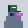


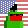


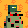
...

and in 8x (224×224px) in [**/i@8x**](i@8x):

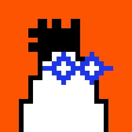
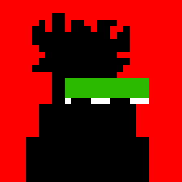
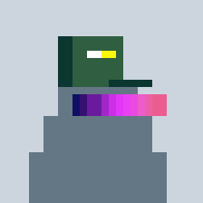
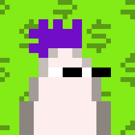
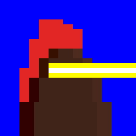
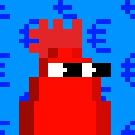
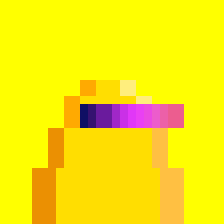

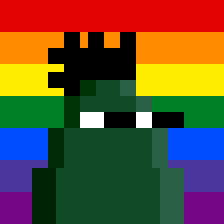
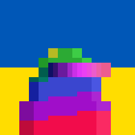

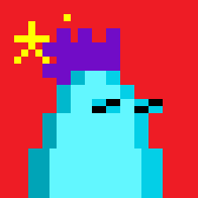
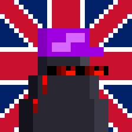
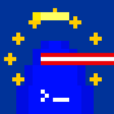
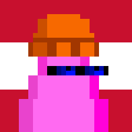

...


Find all meta data in the [letsrock.csv](letsrock.csv) tabular dataset e.g.

```
id, type, accessories, background
0, maxibiz, peakspike / maxibiz lasereyes blue, bitcoin orange
1, black, wildhair / eyes pepe, red
2, default, cap subway / eyes blend, default
3, albino, peakspike purple, dollar pattern
4, brown, mohawk red / lasereyes gold, blue
5, demon, peakspike red / eyes big, euro pattern
6, golden, eyes blend, yellow
7, gray, eyes zombie, classic
8, green, peakspike, rainbow
9, memepool, eyes blend, ukraine
10, pepe, mohawk2 / eyes red, usa
11, alien, peakspike purple, china
12, deathbot, cap, great britain
13, safemode, halo / lasereyes red, europe
14, pink, knittedcap / eyes blue, austria
15, zombie, cap subway, bitcoin pattern
...
```


Bonus - All together now. Find the composite fam image of all 1000 in a 50×20 grid in [letsrock.png](letsrock.png) (~200k - 1400×560px).


## Builders Corner - Yes, You Can

For reference find all (generative) attributes (base types, backgrounds and accessories) in 28×28px in [**/attributes**](attributes).

Yes, you can generate your own samples via "text prompts" using the generate_samples script
and you can regenerate this random set 
using the generate_meta script
and using the generate script to generate all images
from the tabular dataset.


## Questions? Comments?


Join us in the [Ordbase (Incl Ordgen / ORC-721) discord (chat server)](https://discord.gg/dDhvHKjm2t). Yes you can.
Your questions and commetary welcome.

Or post them over at the [Help & Support](https://github.com/geraldb/help) page. Thanks.

